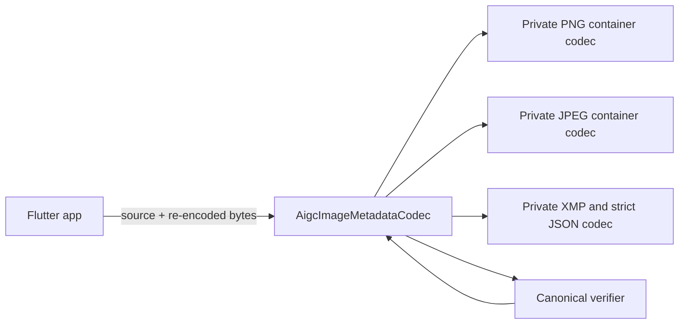

# AIGC Image Metadata Package Design

## Architecture

The public library exports immutable models, policies, limits, typed errors,
and one stateless codec. Container records and parsers remain private. The
Flutter app owns pixel decoding, visible watermarking, and gallery saving.

## Package layout

- `lib/aigc_image_metadata.dart`: curated public exports.
- `lib/src/models.dart`: immutable public values and policies.
- `lib/src/errors.dart`: stable public error model.
- `lib/src/codec.dart`: public orchestration and exception boundary.
- `lib/src/png_codec.dart`: PNG structure, text containers, CRC, canonical write.
- `lib/src/jpeg_codec.dart`: JPEG segments/scans, APP1, dimensions, write.
- `lib/src/xmp_codec.dart`: safe XML extraction, strict JSON, validation, XMP build.

## Read flow

1. Enforce image byte limit and detect the signature.
2. Parse the complete container structure and dimensions.
3. Extract standard XMP and legacy PNG AIGC payloads.
4. Require one payload, parse strict JSON, and validate its seven values.
5. Apply compatible/canonical and propagation policies.
6. Return immutable metadata and container diagnostics.

## Write flow

`embed` validates the target and metadata, applies the target-XMP policy,
writes one canonical XMP packet, and calls `verifyCanonical` on the result.

`transplant` first reads the source, validates format/dimension policy against
the independently parsed target, then delegates to canonical embedding. Only
the seven-field logical metadata crosses from source to target.

## Canonical structures

- PNG: one uncompressed UTF-8 `iTXt` named `XML:com.adobe.xmp`, directly after
  IHDR. All standard XMP and legacy `AIGC` text containers are removed when
  replacement is authorized.
- JPEG: one APP1 with `http://ns.adobe.com/xap/1.0/\0`, directly after SOI. All
  standard XMP APP1 segments are removed when replacement is authorized.

## Safety and errors

All public methods execute through a boundary that preserves an existing
`AigcMetadataException` and maps any other parser/runtime error to a stable
package exception. XML containing DTD or ENTITY declarations is rejected before
parsing. PNG compressed text is decompressed through a capped sink.

Exception messages contain developer diagnostics only. Integrators branch on
`code`, log minimally where appropriate, and map failures to their own localized
user messages.

## Compatibility

The package SDK range is `>=3.3.0 <4.0.0`. XML is constrained to a range that
can resolve to XML 6 on lower SDKs and XML 7 on current SDKs. `dart:io` zlib is
used in 0.1.0, so Web is intentionally unsupported.

## App migration

The root app adds a path dependency and imports the package public library.
The prior local codec is removed. `AigcImageProcessor` uses `transplant`, keeps
Flutter pixel decoding as the final displayability check, and exposes no raw
package diagnostics to the UI.

## Test strategy

Tests cover both formats, policies, strict metadata/XML/JSON parsing, structural
errors, byte preservation, round trips, idempotency, typed errors, input
immutability, and deterministic mutations. Image fixtures are fully decoded by
the `image` dev dependency. Backend-produced fixtures may be added to
`test/fixtures` without changing the public API.
